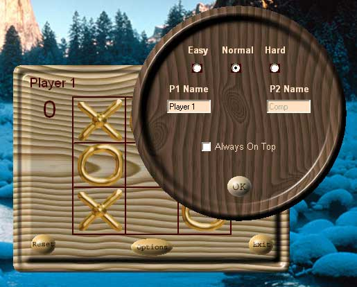



## Graphical Forms And Buttons \(Tic Tac Toe\)

### Description

Basically it is a tic tac toe game but the purpose is to show the graphical possibilities in your programs using the standard vb controls and windows API.Shaped forms(rounded ,elliptic etc) , fancy buttons etc
 
### More Info
 

             |
---                |---
**Submitted On**   |2001-12-05 02:55:04
**By**             |[Asim Aziz](https://github.com/Planet-Source-Code/PSCIndex/blob/master/ByAuthor/asim-aziz.md)
**Level**          |Intermediate
**User Rating**    |4.6 (74 globes from 16 users)
**Compatibility**  |VB 6\.0
**Category**       |[Graphics](https://github.com/Planet-Source-Code/PSCIndex/blob/master/ByCategory/graphics__1-46.md)
**World**          |[Visual Basic](https://github.com/Planet-Source-Code/PSCIndex/blob/master/ByWorld/visual-basic.md)
**Archive File**   |[Graphical\_394301242001\.zip](https://github.com/Planet-Source-Code/asim-aziz-graphical-forms-and-buttons-tic-tac-toe__1-29475/archive/master.zip)

